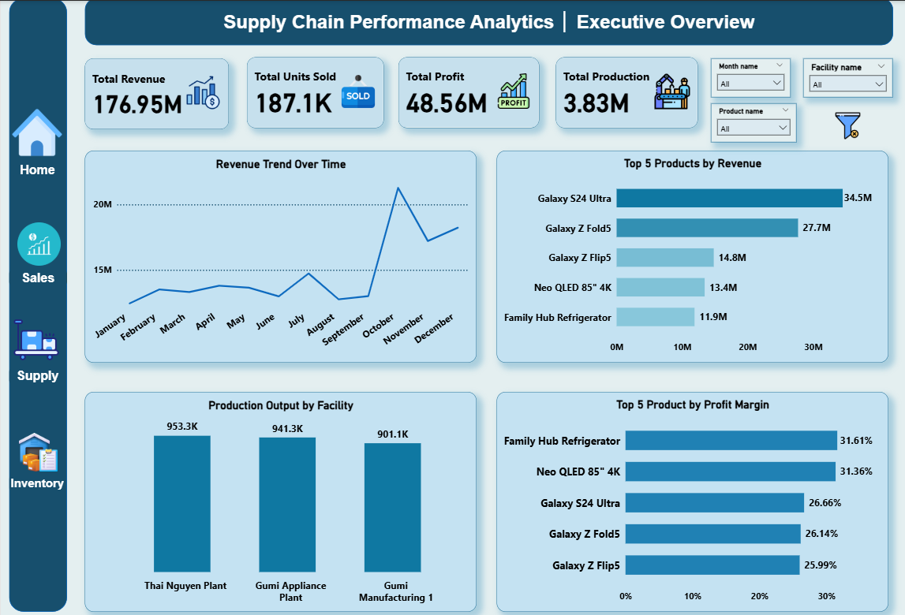
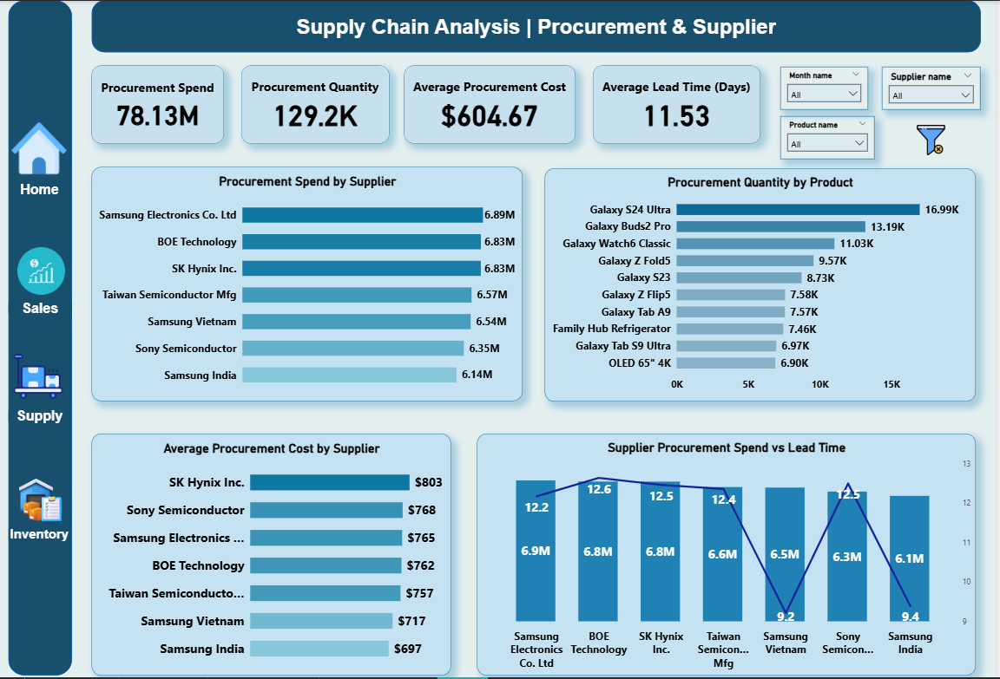
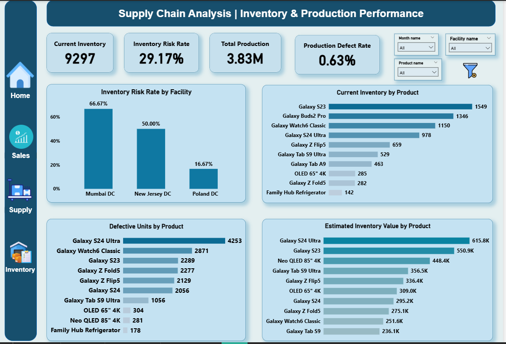
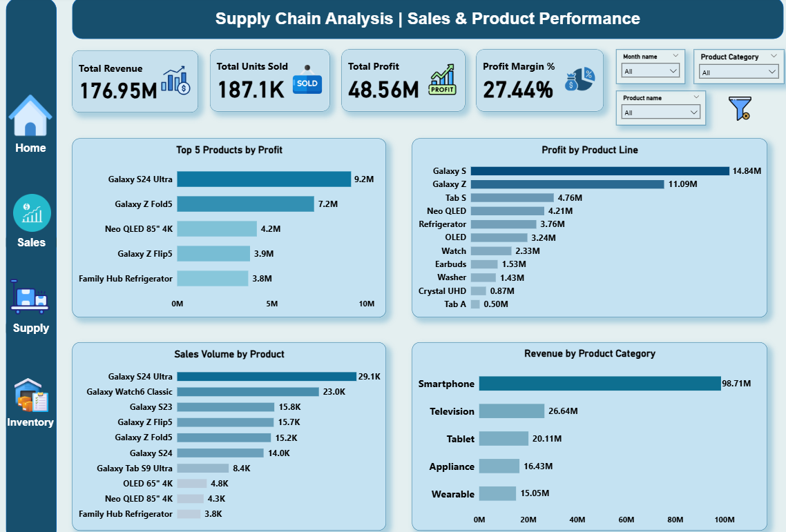

# 📦 Supply Chain Performance & Analytics Dashboard

> An end-to-end supply chain analytics project built with **PostgreSQL, SQL, Power BI, and DAX** to understand procurement, inventory, production, and sales performance.


## 🎯 About the Project

This project looks at supply chain performance from procurement through sales.

The main goal was to take raw transactional data, analyze it using SQL, build a structured data model in Power BI, and turn the results into an interactive dashboard that can support practical business decisions.

The analysis covers four main areas:

- Procurement & supplier performance
- Inventory health
- Production performance
- Sales & product performance

---

## 💡 Business Questions

The analysis was built around practical business questions, including:

- Which suppliers account for the highest procurement spend?
- How do suppliers compare in cost, lead time, and quality?
- Which products have the highest procurement volume?
- Where is inventory risk concentrated?
- Which products have the highest inventory levels and estimated inventory value?
- Which facilities have the highest production output?
- Which products have the highest number of defective units?
- Which products and product lines generate the most profit?
- Which product categories contribute the most revenue?

---

## 🛠️ Tools & Technologies

| Tool | Used For |
|---|---|
| **PostgreSQL** | SQL analysis and business questions |
| **Power BI** | Data modeling and dashboard development |
| **DAX** | KPIs and calculated measures |
| **GitHub** | Project documentation and version control |

---

## 🗂️ Dataset

The project uses a relational supply chain dataset made up of dimension and fact tables.

### Dimension Tables

- `dim_product`
- `dim_customer`
- `dim_supplier`
- `dim_facility`
- `dim_date`

### Fact Tables

- `fact_procurement`
- `fact_inventory`
- `fact_production`
- `fact_sales`

The dataset covers a two-year period and includes product, supplier, facility, procurement, inventory, production, and sales information.

---

# 📈 Dashboard

## 1️⃣ Executive Overview


The first page provides a high-level view of overall business performance.

### KPIs
- Total Revenue
- Total Units Sold
- Total Profit
- Total Production

### Key Visuals
- Revenue Trend Over Time
- Top 5 Products by Revenue
- Production Output by Facility
- Top 5 Products by Profit Margin

**Purpose:**  
To quickly identify the main revenue, profitability, and production contributors.

---

## 2️⃣ Procurement & Supplier Performance


This page focuses on procurement spending and supplier performance.

### KPIs
- Procurement Spend
- Procurement Quantity
- Average Procurement Cost
- Average Lead Time

### Key Visuals
- Procurement Spend by Supplier
- Procurement Quantity by Product
- Average Procurement Cost by Supplier
- Supplier Procurement Spend vs Lead Time

**Purpose:**  
To compare suppliers, understand procurement cost drivers, and identify differences in purchasing volume and lead-time performance.

---

## 3️⃣ Inventory & Production Performance


This page combines inventory health with production performance.

### KPIs
- Current Inventory
- Inventory Risk Rate
- Total Production
- Production Defect Rate

### Key Visuals
- Inventory Risk Rate by Facility
- Current Inventory by Product
- Defective Units by Product
- Estimated Inventory Value by Product

**Purpose:**  
To identify inventory risks, stock concentration, production defects, and products with a higher estimated amount of capital tied up in inventory.

---

## 4️⃣ Sales & Product Performance


The final page focuses on product-level sales and profitability.

### KPIs
- Total Revenue
- Total Units Sold
- Total Profit
- Profit Margin

### Key Visuals
- Top 5 Products by Profit
- Profit by Product Line
- Sales Volume by Product
- Revenue by Product Category

**Purpose:**  
To understand which products and product lines contribute most to profit, while also looking at sales volume and category-level revenue.

---

# 🔎 Key Insights

### 💰 Sales & Profitability

- **Galaxy S24 Ultra** is the strongest revenue and profit contributor in the analyzed sales data.
- **Galaxy Z Fold5** is another major profit contributor.
- **Smartphones** generate the largest share of revenue among the product categories.
- Several TV and home-appliance products show strong profit margins even when their overall revenue is lower than the leading smartphone products.

### 🚚 Procurement

- Procurement spend is spread across several major suppliers rather than being dominated by a single supplier.
- Average procurement cost varies noticeably between suppliers.
- **Galaxy S24 Ultra** has the highest procurement volume among the analyzed products.
- Supplier lead times show noticeable differences that can be considered alongside procurement cost and quality.

### 📦 Inventory

- Inventory risk is concentrated in specific facilities.
- **Mumbai DC** has the highest inventory risk rate among the facilities shown in the dashboard.
- **Galaxy S23** has the highest current inventory level.
- **Galaxy S24 Ultra** has the highest estimated inventory value, indicating a relatively large amount of capital tied up in its current stock.

### 🏭 Production

- **Thai Nguyen Plant** has the highest production output among the facilities analyzed.
- **Galaxy S24 Ultra** has the highest number of defective units.
- High-volume products also contribute significantly to total defective units and may deserve further quality investigation.

> **Note:** Estimated inventory value is an analytical estimate based on current inventory and average procurement cost. It should not be interpreted as an accounting valuation.

---

# 🧠 SQL Analysis

The SQL work was structured around business questions instead of simply running exploratory queries.

### Procurement
- Supplier procurement spend
- Supplier cost, lead time, and quality comparison
- Procurement spend concentration
- Product procurement volume
- Average procurement cost

### Inventory
- Inventory at or below reorder point
- Inventory shortfall
- Current inventory by product
- Inventory risk by facility
- Estimated inventory value

### Production
- Production output by facility
- Production defect rate
- Defective units by product

### Sales
- Revenue by product
- Sales volume by product
- Profit by product
- Profit margin by product
- Revenue by customer
- Revenue trend over time

The analysis was intentionally kept focused on questions that could lead to useful business insights rather than creating a large number of repetitive queries.

---

# 🏗️ Data Model


The Power BI model follows a dimensional structure with shared dimension tables connected to the relevant fact tables.

### Dimensions
```text
dim_date
dim_product
dim_supplier
dim_customer
dim_facility
```

### Facts
```text
fact_sales
fact_procurement
fact_inventory
fact_production
```

This model allows common dimensions such as Date, Product, Supplier, Customer, and Facility to filter the related business processes consistently.

---

# 🧮 Selected DAX Measures

### Total Revenue
```DAX
Total Revenue =
SUM(fact_sales[net_revenue])
```

### Total Profit
```DAX
Total Profit =
SUM(fact_sales[profit])
```

### Total Units Sold
```DAX
Total Units Sold =
SUM(fact_sales[quantity_sold])
```

### Total Production
```DAX
Total Production =
SUM(fact_production[quantity_produced])
```

### Profit Margin
```DAX
Profit Margin =
DIVIDE(
    [Total Profit],
    [Total Revenue]
)
```

### Total Procurement Spend
```DAX
Total Procurement Spend =
SUM(fact_procurement[total_cost])
```

### Average Procurement Cost
```DAX
Average Procurement Cost =
DIVIDE(
    [Total Procurement Spend],
    [Total Procurement Quantity]
)
```

### Average Lead Time
```DAX
Average Lead Time =
AVERAGE(fact_procurement[lead_time_days])
```

---

# ✅ Data Validation

Before building the dashboard, the data was checked for:

- Missing values
- Duplicate records
- Unique dimension keys
- Foreign key integrity
- Fact table consistency
- Revenue calculations
- Procurement cost calculations
- Production defect calculations
- Inventory snapshot consistency

Care was also taken when combining fact tables to avoid row multiplication and incorrect aggregations.

A shipment table was reviewed separately but was not included in the final integrated model because its product, customer, and facility IDs did not align with the corresponding dimension tables.

---

# 🔄 Project Workflow

```text
Raw Data
   ↓
Data Validation
   ↓
SQL Analysis
   ↓
Power BI Data Modeling
   ↓
DAX Measures
   ↓
Dashboard Development
   ↓
Business Insights
```

---

# 📁 Project Structure

```text
supply-chain-performance-analytics/
│
├── data/
│   ├── dim_product.csv
│   ├── dim_customer.csv
│   ├── dim_supplier.csv
│   ├── dim_facility.csv
│   ├── dim_date.csv
│   ├── fact_procurement.csv
│   ├── fact_inventory.csv
│   ├── fact_production.csv
│   └── fact_sales.csv
│
├── sql/
│   ├── procurement_analysis.sql
│   ├── inventory_analysis.sql
│   ├── production_analysis.sql
│   └── sales_analysis.sql
│
├── powerbi/
│   └── supply_chain_dashboard.pbix
│
├── images/
│   ├── home.png
│   ├── supplier.png
│   ├── inventory.png
│   └── sales.png
│
├── docs/
│   ├── Project_Charter.pdf
│   ├── Data_Profiling_Report.pdf
│   └── Business_Requirement_Document.pdf
│
└── README.md
```

---

# 🎯 Key Takeaway

This project demonstrates a complete analytics workflow:

**Raw Data → SQL → Data Modeling → DAX → Power BI → Business Insights**

The focus was not only on creating visuals, but on connecting the analysis to practical supply chain questions and presenting the results in a clear, interactive format.

The final dashboard brings together:

**Procurement → Supplier → Inventory → Production → Sales**

to provide a broader view of supply chain performance.

---

# 👤 Author

## Shahadat Hossain Sajim

**Aspiring Data Analyst | SQL | Power BI | Data Analytics**

I enjoy working with data to uncover useful business insights and present them through clear, practical dashboards.

### 🔗 Connect With Me

- **GitHub:** [Shahadat Hossain Sajim](https://github.com/SH-Sajim)
- **LinkedIn:** [Shahadat Hossain Sajim](https://www.linkedin.com/in/sh-sajim/)

---

⭐ **Thanks for checking out the project!**

